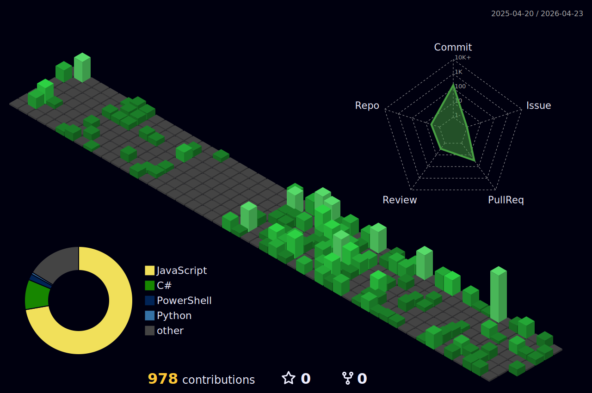

  <h2>Good morning, afternoon and night! 👋</h2>

  <h3> Hy there, I am Pedro Fonseca </h3> 
  
I am a Software Developer with a specialized background in Database Reliability and Cloud Infrastructure..

  
  
I bridge the gap between development and operations. While my career started in Support and DBA roles—managing complex environments like SQL Server, my focus has always been on automation and development. I am now fully dedicated to Engineering roles where I can build software that solves big world problems.

  
My primary focus is on Backend Development using Java and Python. I also work with JavaScript (React/Next.js) for frontend applications.

  
Unlike many developers, I feel at home with the database layer. I have extensive experience managing and querying  PostgreSQL, MySQL, ClickHouse, BiqQuery and SQL Server . I am also proficient in Docker, Kubernetes, and Terraform, ensuring that the applications I build are easy to deploy and scale.

  
  
I am a Linux enthusiast (specifically Debian) and I prioritize Open Source solutions in my stack. I believe in the <strong>power of open-source</strong> 

  
  
I enjoy experimenting with hardware and automation using Arduino.

---

### Portfolio

- https://portfolio-two-blush-90.vercel.app/
- https://www.nievo.site/

---

### Projects

- [Airflow - Transfer data from PSQL-MYSQL to Clickhouse](https://github.com/pedrovtof/Python-Airflow-transfer-data)
- [Finance helper](https://github.com/pedrovtof/Controle-de-orcamento)

---

### More about me

---

### 🛠️ Some things I have work experience with:

**⚙ Programming** 

**☁️ Cloud & Infrastructure** 

**🗄️ Databases & Data** 

**💻 OS & Systems** 

**🛠️ Tools & Observability** 

**🤖 AI** 

 

### 📊 GitHub Stats

  

  
  
 

  <picture>
  <source media="(prefers-color-scheme: dark)" srcset="https://raw.githubusercontent.com/pedrovtof/pedrovtof/output/github-contribution-grid-snake-dark.svg">
  
</picture>

  

  	
    
  

  

---

### 📫 How to reach me:

pedrovotf@gmail.com 
  
 
 
 
  

